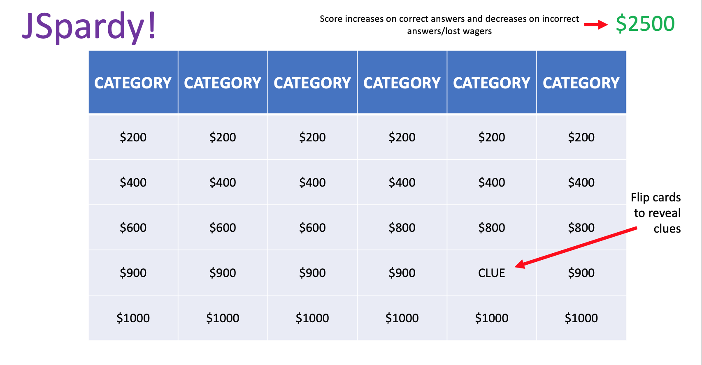

## Background 

JSpardy! is a playable spinoff of my favorite game show, *Jeopardy!* I religiously watch *Jeopardy!* every night, and I hope to capture the feeling of being a contestant on the show through this game. For those unfamilar, *Jeopardy!* is a trivia-based game show where contestants buzz in to answer clues from a game board. The clues are divided into 6 categories, and each clue contains a dollar value that is awarded to the contestant that correctly answers it. JSpardy! will allow a player to select categories (or choose random ones) and play their own full game of *Jeopardy!* 

## Functionality & MVPs 

In JSpardy!, users will be able to: 

- Play a full game of *Jeopardy!* using real game clues from past episodes
- Select categories or choose random ones to play
- Keep track of their score
- Wager on daily doubles placed randomly across the board
- Participate in the Final Jeopardy round
- Play locally against another player

In addition, this project will include: 

- Full game instructions
- A production README

## Wireframe 

- Nav links will be displayed below to the projects GitHub repo and my LinkedIn.
- When players select cards, the card will flip and display the clue, as well as an input box for the player to enter an answer.
- The score will be kept in the top right. 
- A dropdown will be added for local multiplayer, allowing two players to buzz in answers (Bonus)

## Technologies and APIs

This project will be implemented with the following technologies: 

- HTML5
- CSS/SCSS
- JavaScript
- jService API

## Implementation Timeline

- **Friday Afternoon & Weekend:** Learn more and full understand the jArchive API that I will be using. Outline my object heirarchy. Start creating objects.
- **Monday:** Begin implementing game logic and DOM. 
- **Tuesday:** Continue adding game logic, DOM, and additional features.
- **Wednesday:** Focus on styling, layout, UI, and design. 
- **Thursday:** Deploy to GitHub pages. Rewrite this proposal as a production README.
