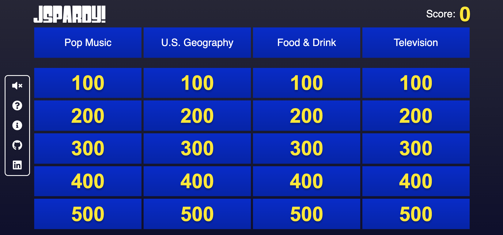
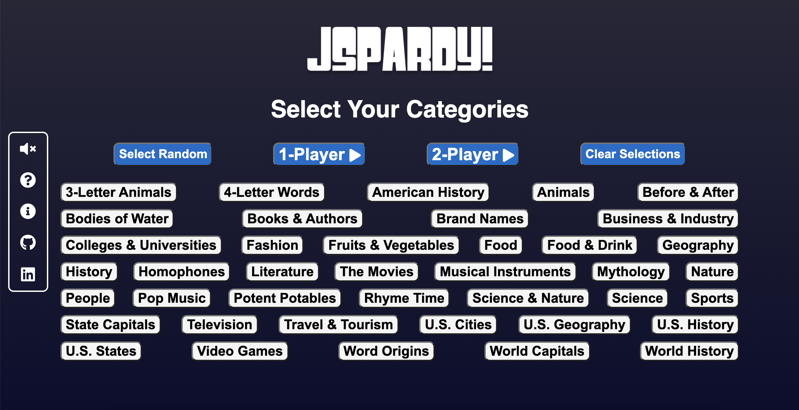

## Introduction

Live site: [JSpardy!](https://simonpuno.github.io/JSpardy/)



JSpardy! is a playable spinoff of my favorite game show, *Jeopardy!* I religiously watch *Jeopardy!* every night, and I hope to capture the feeling of being a contestant on the show through this game. For those unfamilar, *Jeopardy!* is a trivia-based game show where contestants buzz in to answer clues from a game board. The clues are divided into 6 categories, and each clue contains a dollar value that is awarded to the contestant that correctly answers it. JSpardy! allows a player to select categories (or choose random ones) and play their own full game of *Jeopardy!* 

## How to Play 



1. Select categories (no restrictions on how many you pick).
2. Choose one or two players.
3. If playing with two players, read the popup on how each player can buzz in to answer a question.
4. The game board will appear, select any clue to get started.
5. Correct answers will add that clue's value to your score; incorrect answer will substract that value; no penalty for skipping a clue.
6. If you feel your response was unfairly judged, click the 'Dispute Answer' button to receive your points back.

Bonus: 
- Click the speaker icon to play music.
- Click the '?' icon for instructions.

## Technologies and APIs

This project is implemented using the following technologies: 

- HTML5
- SCSS
- vanilla JavaScript
- [jService API](https://jservice.io/)

## Technical Implementation Snippets 

### Regex 

JSpardy! makes use of Regular Expressions (regex) to fix user answers and compare them to the answer fetched from the API. This gives players some leeway when typing their answers. In other words, player input does not have to perfectly match the actual answer. It is not a perfect system yet, and in the future, I'd like to refine the regex even further.

```javascript
    fixAnswer(input, answer) {
        if (input === "") {
            this.skip = true;
            return true;
        };
        const lowInput = input.toLowerCase();
        const lowAnswer = answer.toLowerCase();
        const regexInput = '\\b' + lowInput + '\\b'
        const regex = new RegExp(regexInput);
        return regex.test(lowAnswer);
    }
```

### API Calls and Board Rendering

To fetch the categories, I makes a call to the API with the category IDs tied to the player-selected categories. Then, I iterate through the categories, grabbing the necessary data and saving it to the appropriate variables. Finally, I render the categories and clues with each clue being tied to a specific answer and HTML element.

```javascript 
getCategories () {
        const categories = this.categoryIDs.map (categoryID => {
            return new Promise((resolve, reject) => {
                fetch(`https://jservice.io/api/category?id=${categoryID}`)
                .then(res => res.json())
                .then(data => {
                    resolve(data);
                })
            })
        });

        Promise.all(categories).then(results => {
            results.forEach((category, categoryIdx) => {
                var newCat = {
                    title: category.title,
                    clues: []
                }

                shuffle(category.clues).slice(0,5).forEach((clue, idx) => {
                    let clueID = categoryIdx + '-' + idx;
                    newCat.clues.push(clueID);
                    clue.answer = clue.answer.replace("<i>", "");
                    clue.answer = clue.answer.replace("</i>", "");

                    this.clues[clueID] = {
                        question: clue.question,
                        answer: clue.answer,
                        value: (idx + 1) * 100,
                        category: category.title
                    }
                })

                this.categories.push(newCat);
            })
            this.categories.forEach(category => {
                this.renderCategory(category);
            })
        })
    }
```